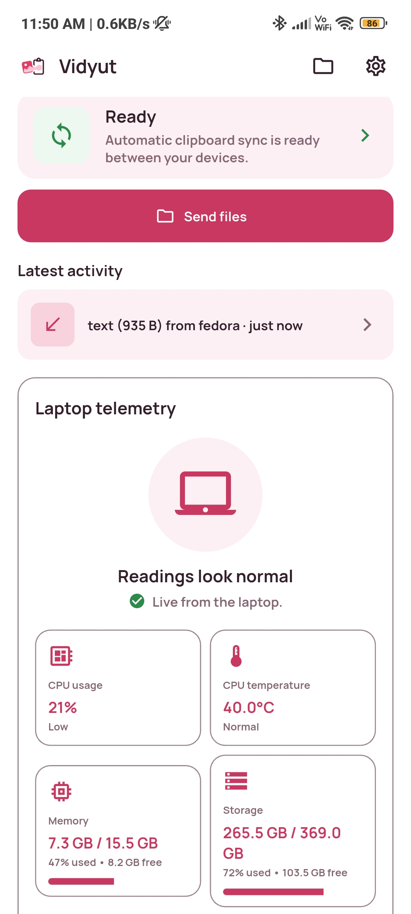
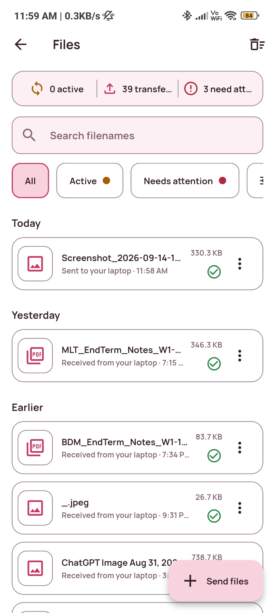
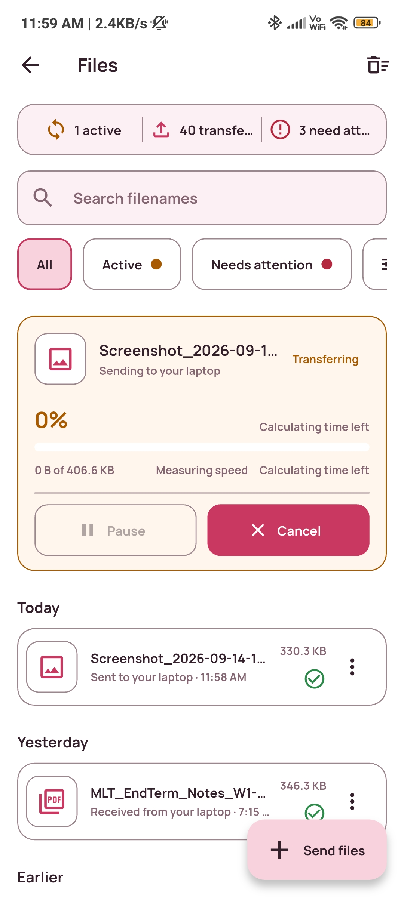

# Vidyut

[](https://github.com/Snehit70/vidyut/actions/workflows/ci.yml)
[](LICENSE)

Copy a screenshot or some text on your Linux laptop, paste it on your Android phone a second later. Or the other way around. Same WiFi. Nothing leaves the LAN.

<p align="center">
  
  
  
</p>

Vidyut keeps one clipboard pool between those two devices. The newest copy wins. There is no history.

The idea is the same as Universal Clipboard. Android forbids background clipboard reads, so the phone publishes on purpose through the share sheet, screenshot auto-push, or a notification action. Incoming payloads can land with zero taps once clipboard permission is granted.

Files are a separate path. You send them on purpose. Interrupted transfers resume from receiver-confirmed progress, and complete files are checked with SHA-256 before they become visible.

The laptop runs a compiled Bun relay. It watches the Wayland clipboard, holds the current encrypted payload, advertises `_vidyut._tcp` over mDNS, and talks to the phone over a LAN WebSocket. Pairing is a QR code or a one-line host, port, and secret. The phone is the Flutter app in `app/`. It stays connected through a foreground service so Android does not kill it the moment you switch apps.

Every clipboard payload and file chunk is end-to-end encrypted with the pairing secret. Other devices on the WiFi cannot read it. The relay never sees plaintext.

## Guides

- [docs/SETUP.md](docs/SETUP.md). First pairing, laptop and phone, about five minutes.
- [docs/USAGE.md](docs/USAGE.md). Daily copy, paste, screenshots, and file sending.
- [docs/INSTALL.md](docs/INSTALL.md). systemd user service, tray, and file-manager actions.
- [docs/TROUBLESHOOTING.md](docs/TROUBLESHOOTING.md). Field-verified fixes.
- [CONTEXT.md](CONTEXT.md). Words used in the code and the docs.

The rest of this file is how to build the relay from source.

## Relay prerequisites

- A Linux Wayland session. X11 and headless are not supported.
- `wl-clipboard` 2.3 or newer, so `wl-copy` and `wl-paste` exist. 2.3 added `ext-data-control-v1`, which KDE/KWin needs.
- ImageMagick is recommended. Phone screenshots often arrive as JPEG, and most Linux apps only paste PNG. The relay re-encodes when `magick` is present.
- Bun 1.3.3 to build and test. The installed binary does not need Bun at runtime.

## Run the relay

```bash
bun install
bun run build:relay
./dist/vidyut-relay --log-level info
```

On first run the relay creates `~/.config/vidyut/relay.json` with a persistent pairing secret, prints a QR code, and prints the manual fallback:

```text
host=<lan-ip> port=17321 secret=<pairing-secret>
```

The secret does not rotate across restarts. Pair once.

The relay refuses to start if the configured port is already in use. It also advertises `_vidyut._tcp` over mDNS so the phone can find it without typing a host.

## Install as a service

```bash
bun run install:relay
```

That compiles `dist/vidyut-relay`, installs it to `~/.local/bin/`, enables the `systemd --user` unit, and starts it with your graphical session. The installer also adds a tray, a file picker, and Send with Vidyut actions for Dolphin and Nautilus.

See `docs/INSTALL.md` for pairing under systemd, firewall notes, and service commands.

## Android app

The Flutter app lives in `app/`. From there:

```bash
flutter pub get
flutter analyze
flutter test
flutter build apk --debug
```

CI pins Flutter 3.44.4 on the stable channel. Details are in `app/README.md`.

## Development checks

```bash
bun run typecheck
bun test
bun run build:relay
```
